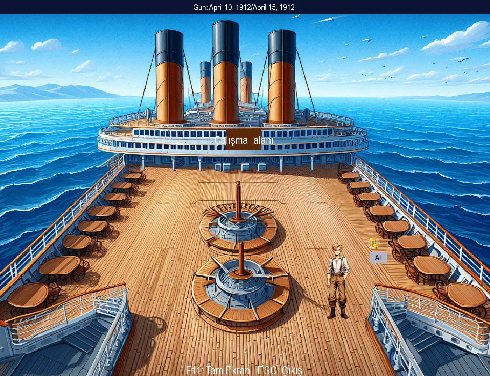

# Titanikte Zirveye - Titanik Borsa Simülasyonu



Titanik gemisinde geçen interaktif borsa simülasyon oyunu. 1912 yılında gemi yolculuğu sırasında gemi şirketlerinin hisselerini alıp satarak ekonomik zirveye çıkmaya çalışan bir oyuncu. 
Geminin farklı odalarında dolaşıp çeşitli aktiviteler yapabilir. 
Pygame kütüphanesi kullanılarak geliştirilmiş, nesne yönelimli programlama  prensipleriyle yapılandırılmış bir 2D oyun projesidir.
Oyun projesi tamamlanmamıştır. Proje başlangıç aşamasındadır. 

## 🚀 Özellikler

- Real-time hisse senedi fiyat değişimleri
- Çoklu oda sistemi (güverte, kabin, çalışma alanı, borsa salonu)
- Karakter animasyonları ve hareket sistemi
- Tam ekran/pencere modu desteği
- Dinamik çözünürlük ayarları
- Historik 1912 Titanik teması

## 🛠️ Teknolojiler

- Python 3.x
- Pygame
- Nesne Yönelimli Programlama

## 📦 Kurulum

```bash
pip install pygame
git clone https://github.com/kullaniciadin/titanikte-zirveye.git
cd titanikte-zirveye
python main.py
```

## 🎮 Oynanış

- **W,A,S,D** veya **Ok tuşları**: Hareket
- **Mouse**: Etkileşim ve menü kontrolü
- **F11**: Tam ekran
- **ESC**: Menüye dön

## 📸 Ekran Görüntüleri

(Buraya oyun içi screenshotlar ekleyebilirsin)

## 📝 Lisans

MIT License
